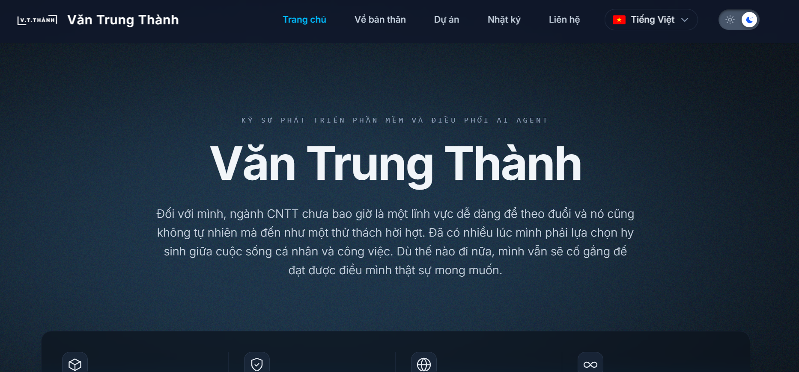
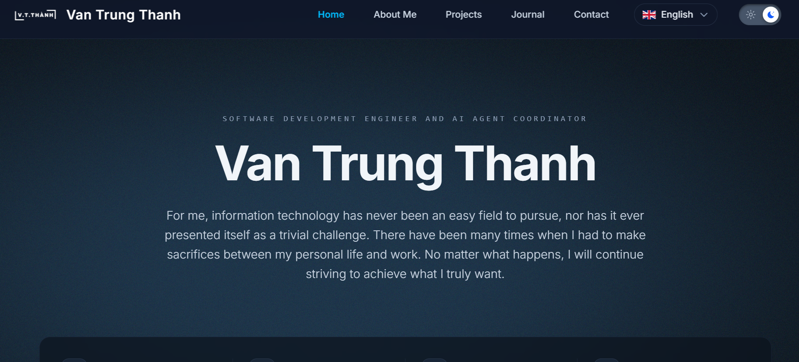
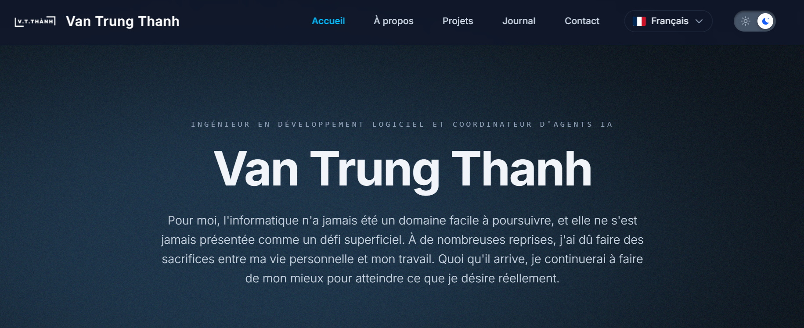
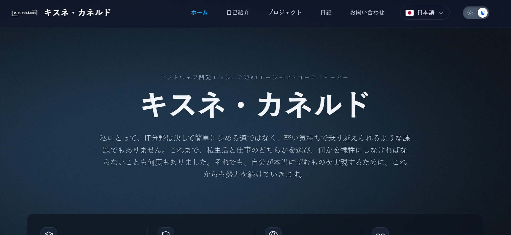
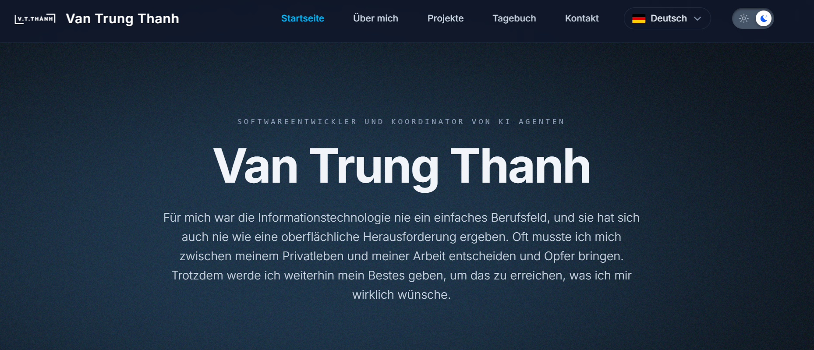
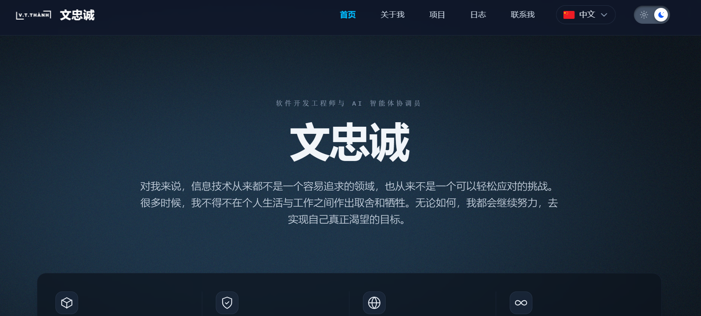

# V.T.Thanh's Home

## I. Introduction
Rebuilding my personal website from the ground up using Angular and Spring Boot. While AI assists with high-level planning and architecture, 100% of the production code is hand-copied (Well, at least that’s the plan until the first bug hits and I start full turbo vibe coding with Gehihi again).

## II. Tech stacks
- CI/CD: GitHub Actions (Free tier)
- Backend: Spring boot (4.11)
- Frontend: Angular (22.x)
- Tools: uv (0.12.21), mage (1.17.2), Gemma 2 9B model.

## III. References
1. Previous Home Design: [JuniorThanhBQ](https://www.juniorthanh.id.vn/)
2. Vercel: [Docs](https://vercel.com/docs)
3. Angular: [Docs](https://angular.dev/overview)
4. Spring boot: [Docs](https://docs.spring.io/spring-boot/index.html)
5. Inspiration: [Awwwards Website Design](https://www.awwwards.com/)

## IV. Website Status

## V. Home Page

> Vietnamese
>

> English
> 

> French
> 

> Japanese
> 

> German
> 

> Chinese
> 
